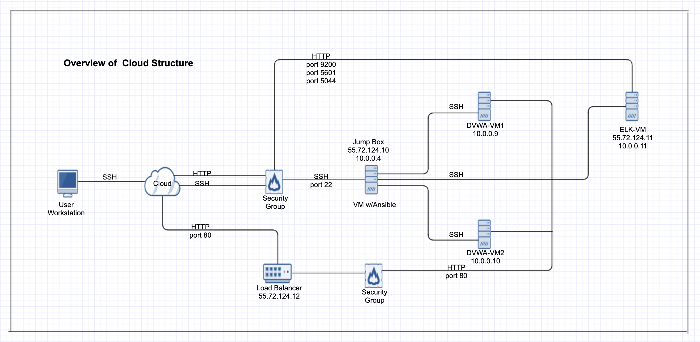
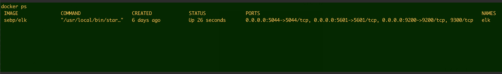

## Automated ELK Stack Deployment

The files in this repository were used to configure the network depicted below.



These files have been tested and used to generate a live ELK deployment on Azure. They can be used to either recreate the entire deployment pictured above. Alternatively, select portions of the yml file may be used to install only certain pieces of it, such as Filebeat.

  - _The playbook file:_
    - filebeat-playbook.yml
    - filebeat-configuration.yml
    - install_dvwa-playbook.yml
    - install-elk-playbook.yml
    - ansible_elk.cfg
    - ansible_hosts


This document contains the following details:
- Description of the Topology
- Access Policies
- ELK Configuration
  - Beats in Use
  - Machines Being Monitored
- How to Use the Ansible Build


### Description of the Topology

The main purpose of this network is to expose a load-balanced and monitored instance of DVWA, the D*mn Vulnerable Web Application.

- Load balancing ensures that the application will be highly available, in addition to restricting access to the network.

- Jump Box is basically a locked-down secure admin workstation that all is used to first conect to before launching any administrative tasks or use an entry point to connect to other servers.
- Load balancers protects the availibility aspect of security.  In a way, it helps to eliminate single point of failure, reduce the attack surface, and make it hard to exhaust resources.

Integrating an ELK server allows users to easily monitor the vulnerable VMs for changes to the performance and system usages.
- Filebeat is a lightweight shipper for forwarding and centralizing log data. It monitors the log files or location that you specify, collects log events, and forwards them them to Elasticsearch, and logstash for indexing.

The configuration details of each machine may be found below.
_Note: Use the [Markdown Table Generator](http://www.tablesgenerator.com/markdown_tables) to add/remove values from the table_.

| Name     | Function | IP Address | Operating System |
|----------|----------|------------|------------------|
| Jump-Box-Provisioner | Gateway  | 10.0.0.4   | Linux            |
| DVWA-VM1 | Docker   | 10.0.0.9   | Linux            |
| DVWA-VM2 | Docker   | 10.0.0.10  |    Linux             |
| ELK-VM   | Elasticsearch, Logstash, and Kibana        |      10.0.0.11      |   Linux |

### Access Policies

The machines on the internal network are not exposed to the public Internet. 

Only the Load Balancer machine can accept connections from the Internet. Access to this machine is only allowed from the following IP addresses:

- This is your public IP that has been whitelisted for access.

Machines within the network can only be accessed by ___.
- JumpBox's Ansible container (10.0.0.4) is the only machine that is allowed to access ELM VM.


A summary of the access policies in place can be found in the table below.

| Name     | Publicly Accessible | Allowed IP Addresses |
|----------|---------------------|----------------------|
|Incoming_SSH | Yes     | Your own public IP    |
|Port_80       |          Yes           |      Any              |
|Incoming_ELK |       Yes            |    Your own public IP               |
|Port_5044_9200_5601 |       Yes            |    Your own public IP             |

### Elk Configuration

Ansible was used to automate configuration of the ELK machine. No configuration was performed manually, which is advantageous because
- Human error can be eliminated, and same configuration can be replicated onto nodes at mass scale. 

The playbook implements the following tasks:
- Install Docker 
- Download elk image
- Install dependent module such as python-pip
- Configure VM with more memory
- Download elk container
- Install filebeat Debian
- Copy filebeat.yml configuration file.

The following screenshot displays the result of running `docker ps` after successfully configuring the ELK instance.



### Target Machines & Beats
This ELK server is configured to monitor the following machines:
- DVMA-VM1 : `10.0.0.9`
- DVMA-VM2 : `10.0.0.10`

We have installed the following Beats on these machines:
- filebeat

These Beats allow us to collect the following information from each machine:

- Filebeat Systlog provide systemlog events, Systemlog hostnames and processes. 
- Sudo commands log to provide system.auth.sudo.command. 
- Sudo commands by user and Sudo errors. 
- SSH logins provide SSH login attempts, Successful SSH logins, SSH users of failed login attempts and SSH login attempts. 
- New users and groups log provide New users, New users by shell, New users over time, New users by home directory, Newgroups and New groups over time


### Using the Playbook
In order to use the playbook, you will need to have an Ansible control node already configured. Assuming you have such a control node provisioned: 

SSH into the control node and follow the steps below:
- Copy the _____ file to _____.
- Update the _____ file to include...
- Run the playbook, and navigate to ____ to check that the installation worked as expected.

- _Which file is the playbook? Where do you copy it?_
 - `filebeat-playbook.yml`
 - Copy to `DVMA-VM1` and `DVMA VM2` as file  `/etc/filebeat/filebeat.yml` 

- _Which file do you update to make Ansible run the playbook on a specific machine? How do I specify which machine to install the ELK server on versus which to install Filebeat on?_

 - `/etc/ansible/hosts` cantains these entries:

  ``` bash
[webservers]
10.0.0.9
10.0.0.10

[elkservers]
10.0.0.11
```

- To run the playbook:
 ``` bash
  ansible-playbook filebeat-playbook.yml
 ```
- _Which URL do you navigate to in order to check that the ELK server is running?
  ```bash
   "http:<ELK server public IP>:5601"

  and check "syslog->Module Status"
```
